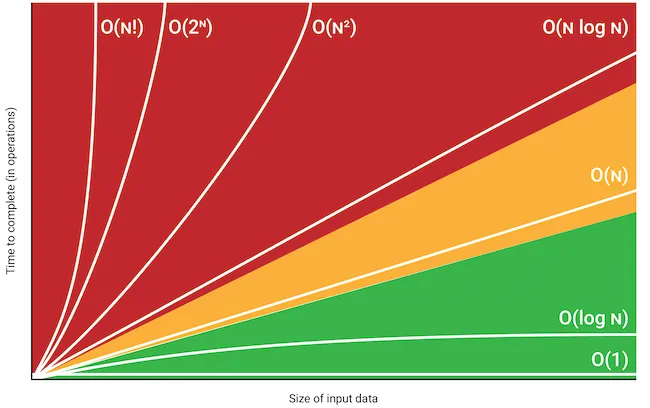
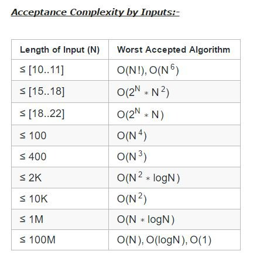

# Big O Notation

Big O notation is a mathematical notation used in computer science to describe the upper bound of the time complexity or space complexity of an algorithm in terms of the size of its input.

**Below is the Graph representation of various Big O**

## Time Complexity

The amount of time taken by an algorithm to run as a function of the size of its input.

### O(n) - Linear Time

- The resources usage increases with the increase in input size.
- The graph increases proportionally, which is straight.

### O(1) - Constant Time

- The algorithm's execution time or resource usage remains constant regardless of the input size.
- The graph is horizontal and parallel to the x-axis regardless of input size.

### O(n^2) - Quadratic Time

- The algorithm's size of operation is n * n.
- The graph is a parabolic curve that rapidly increases as the input size grows.
- It becomes steeper as the input size increases, indicating an exponential relationship between input size and resource usage.

### O(n!) - Factorial Time

- Nested loop for every input we have.
- The most expensive and steepest graph in the Big O Notation.

### O(n log n) - Linearithmic Time

- The algorithm's resource usage grows in a near-linear fashion but is more efficient than quadratic time.
- Commonly seen in efficient sorting algorithms like merge sort and quicksort.
- The graph has a steeper slope compared to O(n), indicating a faster growth rate as the input size increases.

## Big O Rule

- Worst case: Search item at the end of the array while looping.
- Best Case: Search item at the beginning of the array.
- Remove Constants: O(n+1), O(3n + 4), O(2n) - everything is O(n).
- Nested dependency of n: If there is nested n dependency, the time complexity is represented as O(n * n), i.e., O(n^2).
- Drop non-dominant: In case of O(n + n^2), we drop the non-dominant term, i.e., n on the front. It becomes O(n^2), O(n^3), and so on.

## Good Code

1. Readability.
2. Scalability.
   - Speed.
   - Memory.
3. Three pillars to identify the best code:
   - Readable.
   - Speed (Time complexity).
   - Memory usage (Space complexity).

## Space Complexity

The amount of memory taken by an algorithm to run as a function of the size of its input.

- How much of inputs a function can take?
- If there is less memory and more inputs to be stored, it might overflow, known as Stack Overflow.
- Causes:
  1. Variables.
  2. Data Structures.
  3. Function calls.
  4. Allocations.

## TLE (Time Limit Exceeded)

An error message that is returned when the time taken to execute a program takes longer than the time limit allowed.  
Processor being able to compute 10^8 operations per second 
Here is the list of rules that will help to optimize the program and not exceed the time limit:
 

**Solutions:**
Optimize Algorithm, Reduce Input Size, Use Early Exit, Dynamic Programming, Cancel Infinite Loops